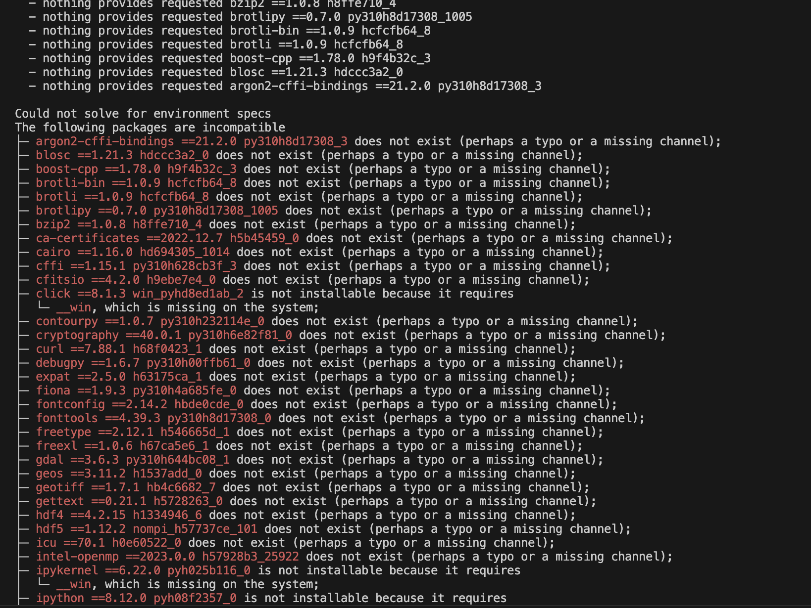

# PLUS_softwaredev_2025_ola

## ASSIGNMENT 2

1. The two files software_dev_v1 and software_dev_v2 were downloaded manually into my computer

2. The command as shown in the picture below was executed to create the first environment

3. This created a 'LibMambaUnsatisfiableError' since this is a MacOS but Windows packages are included in the .yml 

4. The same command was used for the second environment and this successfully installed the packages in the v2.yml file

5. The environment software_dev_v2 was activated and deactivated 
